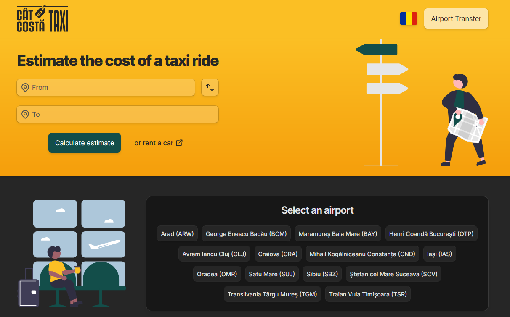

# 🤖 catcostataxi.ro

Get 🚕 taxi trip estimations.

## 🔥 About this project

[catcostataxi.ro](https://www.catcostataxi.ro/) is an open source application built using Next.js 13. It aims to help you estimate a taxi trip using Google Maps API.

## 🛠️ Tech Stack

- [Next.js](https://nextjs.org/)
- [Tailwind CSS](https://tailwindcss.com/)
- [MongoDB](https://www.mongodb.com/)
- [Zod](https://zod.dev/)

## 🚀 Running Locally

1. Install dependencies using pnpm:

```sh
pnpm install
```

2. Copy `.env.example` to `.env.local` and update the variables.

```sh
cp .env.example .env.local
```

3. Start the development server:

```sh
pnpm dev
```

## 🤝 Contributing

Contributions are welcome! If you encounter any issues or have suggestions for improvements, please feel free to open an issue or submit a pull request.

## 📜 License

This project is licensed under the [MIT License](LICENSE.md).
